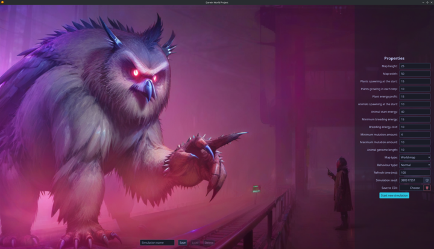

# Darwin World

A JavaFX desktop simulation of evolution in a virtual world, built as a university project for **Programowanie Obiektowe (Object-Oriented Programming)** at AGH University of Krakow, Faculty of Computer Science.

 

Full assignment specification (in Polish): [docs/assignement/README.md](docs/assignement/README.md)


## Assigned Variant: F-4

**F - Creeping Jungle**
New plants appear most often adjacent to already existing plants. If the map is completely cleared, growth falls back to random placement.

**4 - Old Age Is No Fun**
Each turn, an animal may skip its move while still consuming energy. The skip probability rises with age up to a maximum of 80%.

## Features

- Multiple simultaneous simulations, each in its own window on an independent map
- Pause and resume any simulation independently
- Click any animal while paused to track it: genome, active gene, energy, plants eaten, children, descendants, age, death day
- After pausing: highlight animals with the dominant genome, see preferred plant fields
- Live statistics with line chart: animal count, plant count, free fields, popular genome, average energy, average lifetime, average children
- Save and load simulation configurations as JSON
- Optional per-day CSV export compatible with Excel

## Build, Run and Test

Requires Java 21 (see `.mise.toml`).

```bash
./gradlew run         # run the application
./gradlew build       # build
./gradlew test        # run tests only
./gradlew jpackage    # native installer (.exe / .deb / .dmg)
./gradlew runtimeZip  # self-contained runtime image (zipped)
```
